## ChatGPT-MP(基于DeepSeek/ChatGPT等模型实现的聊天微信小程序，适配H5和WEB端)

包含前后台，支持打字效果输出流式输出，支持AI聊天次数限制，支持分享增加次数等功能。**开源版禁止商用，仅供学习交流，禁止倒卖。** 感谢Star！

技术栈：JDK8 + SpringBoot + Vue2 + Uniapp + Mysql

Github地址：https://github.com/oldinaction/ChatGPT-MP

Gitee地址(国内访问更快)：https://gitee.com/smalle/ChatGPT-MP

小程序演示地址

## One能聊天开源版接入其他大模型教程专辑

- [【One能聊天】开发指南](https://mbd.pub/o/bread/ZZ6blZ9x) 🔥🔥🔥
- [One能聊天接入DeepSeek(基于阿里云)](https://mbd.pub/o/bread/mbd-Z56ck5Zs) 🔥
- [One能聊天接入百度千帆大模型 — 文心一言](https://mbd.pub/o/bread/mbd-ZZ6blZ9s)
- [One能聊天接入百度千帆AppBuilder](https://mbd.pub/o/bread/mbd-ZZ6blpZq)
- [One能聊天接入阿里通义千问](https://mbd.pub/o/bread/mbd-ZZ6blpZs)

## 包含功能

- [x] 支持DeepSeek（基于阿里云） 🔥🔥🔥
- [x] ChatGPT聊天
- [x] 百度文心大模型/百度千帆AppBuilder
- [x] 阿里通义千问
- [x] 用户聊天次数限制
- [x] 分享得聊天次数
- [x] 每日领取免费次数
- [x] 查看及清除聊天历史
- [x] 显示连接情况
- [x] 清除聊天历史
- [x] 开通会员
- [x] 购买次数包
- [x] 联系客服领取次数
- [x] 看广告得次数
- [x] 后台管理系统，暂时为升级版功能，之后会择机开源
- [x] 敏感词检测及设置
- [x] 适配H5和WEB端
- [x] 登录方式支持：小程序登录/微信公众号登录/手机号注册登录/邮箱注册登录
- [x] 提示词功能(角色扮演)，内置近300种提示词，包含小红书文案书写、周报生成、异性对话生成器等
- [ ] AI生成图片、语音转换等功能开发中......

## 小程序/H5样式预览

小程序样式

    
    
    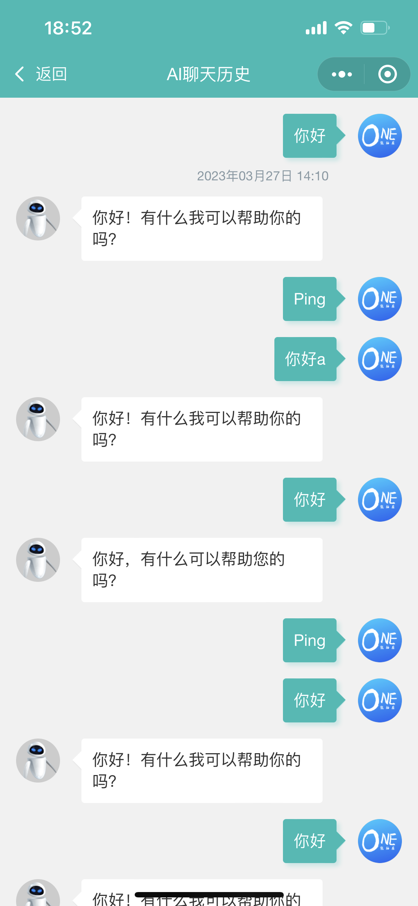

提示词功能

    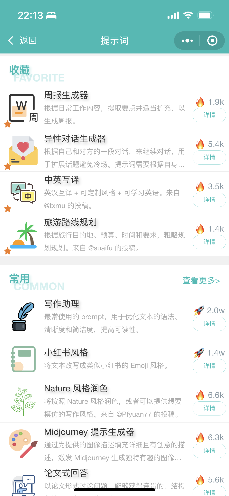
    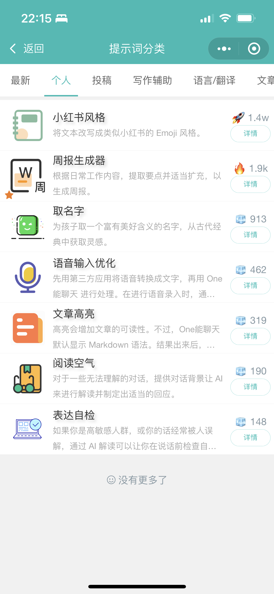
    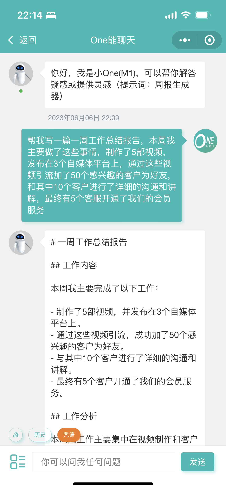

登录注册界面等样式

    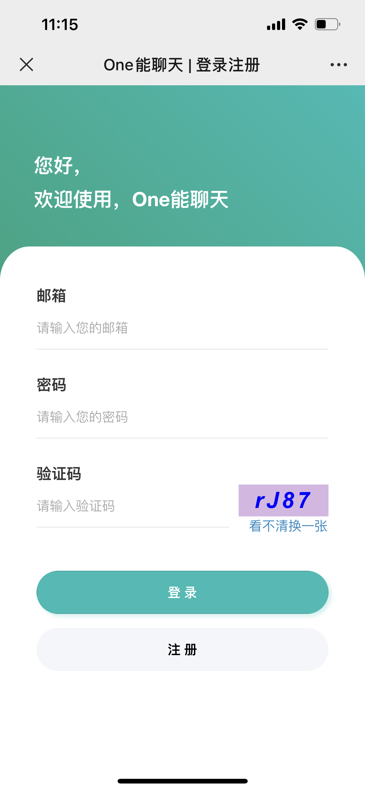
	
	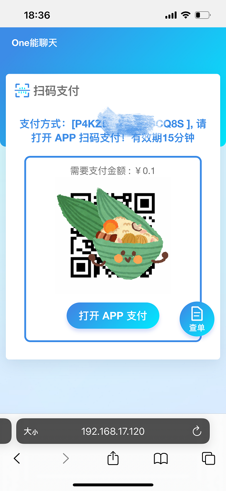

## 后端管理样式预览

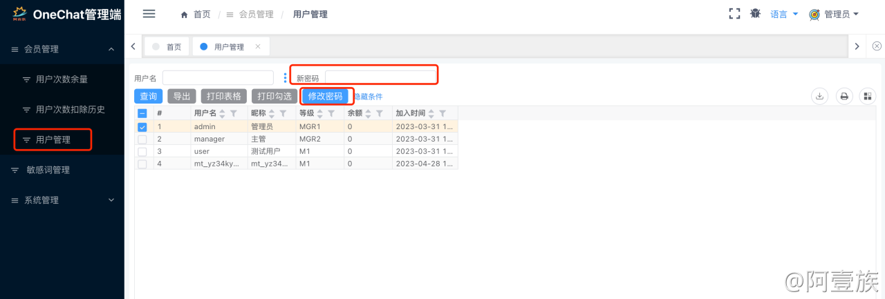

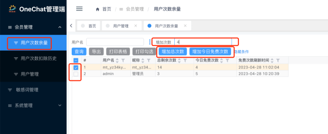

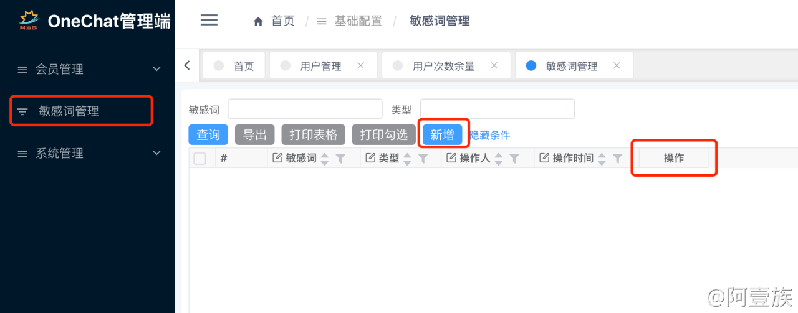

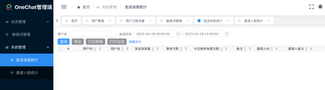

## 开源版部署

### 后端

- 创建Mysql数据库aezo-chat-gpt, 执行脚本文件 aezo-chat-gpt-api/doc/aezo-chat-gpt.sql
- 使用IDEA打开aezo-chat-gpt-api项目
- 修改application.yml中的小程序id和秘钥、OpenAI地址和KEY
- 启动项目

**再加一点点说明：**

此项目开源后，收到了不少Star(感谢~)

其中不少同学非技术出身，很多都卡在后端项目启动这一步，我就将项目编译打包后的Jar一并上传了，之后只需安装好JDK并修改少许配置即可启动，省去了编译环节

Jar包启动方式如下：

1. 安装JDK(略)，网上教程较多
2. 下载dist.zip压缩包后进行解压
3. 修改此目录中的 application-dev.yml 文件(记事本文本编辑器即可打开，配置项已备注清楚)
4. 启动：Windows执行`start.bat`文件，Linux执行`start.sh`文件

### 前端小程序

- 使用HBuilder打开aezo-chat-gpt-m项目
- 修改common/config.js中的API地址
- 运行项目到微信小程序

## 版本功能比对

| 功能 | 开源版 | 专业版 | 说明 |
|--|--|--|--|
| 🔥 DeepSeek模型 | ❌ | ✅ |基于阿里云，支持DeepSeek-R1/DeepSeek-V3等|
| 🔥 ChatGPT聊天 | ✅ | ✅ |支持GPT3.5/GPT4.0|
| 🔥 百度文心大模型 | ❌ | ✅ ||
| 🔥 百度千帆AppBuilder | ❌ | ✅ ||
| 🔥 阿里通义千问 | ❌ | ✅ ||
| 用户聊天次数限制 | ✅ | ✅ ||
| 分享得聊天次数 | ✅ | ✅ ||
| 每日领取免费次数 | ✅ | ✅ ||
| 查看聊天历史 | ✅ | ✅ ||
| 显示连接情况 | ✅ | ✅ ||
| 清除聊天历史 | ✅ | ✅ ||
| 开通会员/购买次数包 | ✅ | ✅ ||
| 联系客服领取次数 | ✅ | ✅ ||
| 看广告得次数 | ✅ | ✅ ||
| 多API KEY池 | ❌ | ✅ ||
| API KEY异常邮件提醒 | ❌ | ✅ ||
| 敏感词过滤 | ❌ | ✅ ||
| 提示词功能(角色扮演) | ❌ | ✅ ||
| H5/WEB端适配 | ❌ | ✅ ||
| 登录注册方式 | 小程序登录 |✅|专业版支持：小程序登录/微信公众号登录/手机号注册登录/邮箱注册登录 |
| 后台管理 | ❌ | ✅ ||
| 详细部署及使用文档 | ❌ | ✅ ||
| 🔥 微信支付/支付宝支付 | ❌ | ❌(为个人支付) |支持定制|
| 售后服务 | ❌ | 知识星球 ||

[需要专业版，戳这里](https://ocvip.oneneng.top/buy/1)

## 交流学习

有问题可进群交流，为了防止各种广告，需小额打赏1元以上~(你的心意就是我最大的动力)，添加请注明来意！

    
点击查看联系方式（需小额打赏，添加注明OneChat）

    

## 案例-写作助手

写作助手小程序样式

    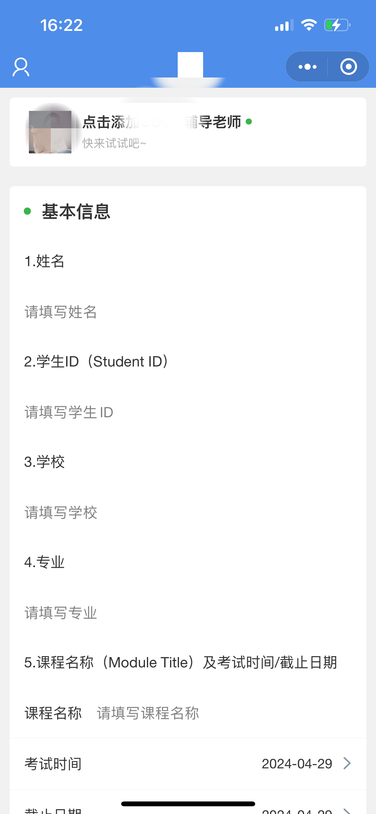
    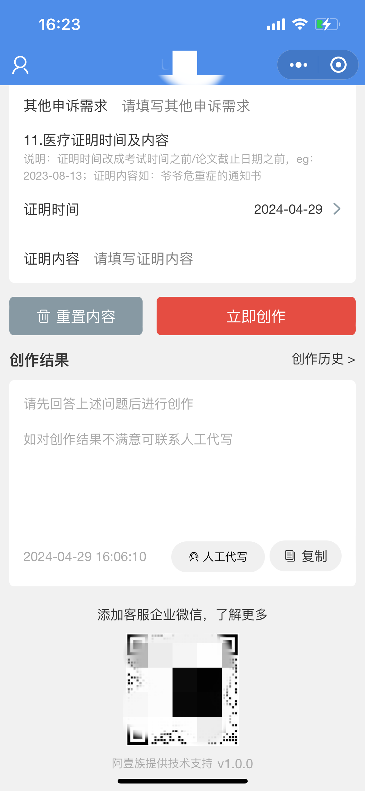

## 案例-旅游智能导览机器人

旅游智能导览机器人

    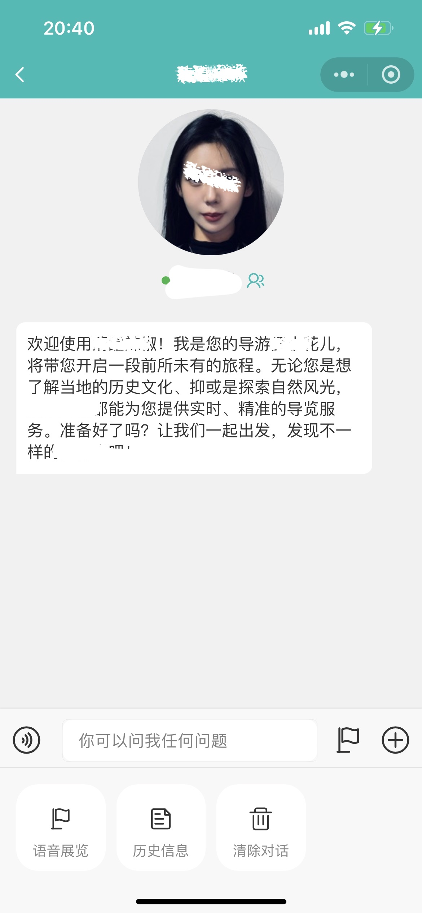
    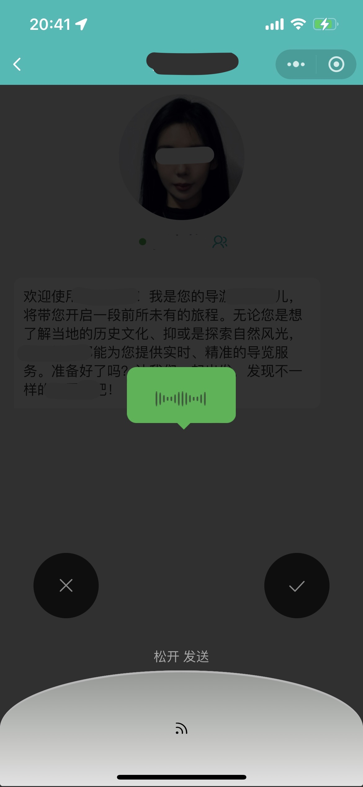
    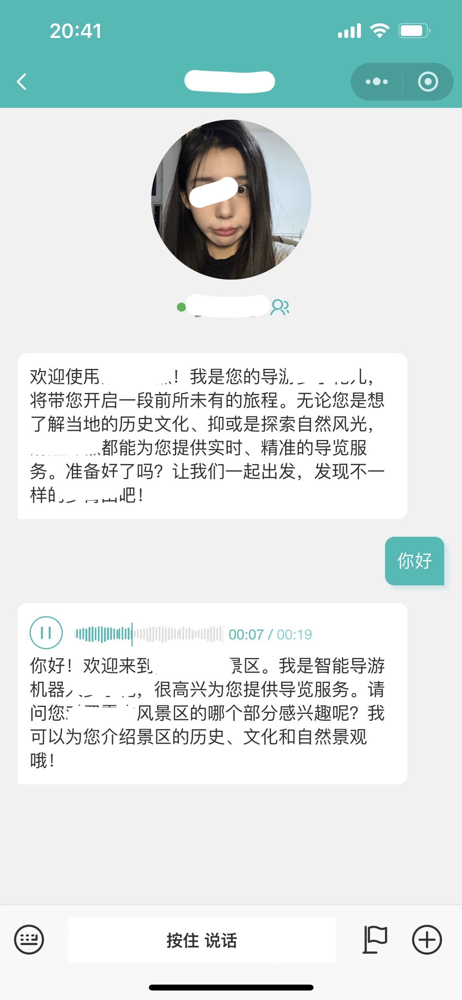

    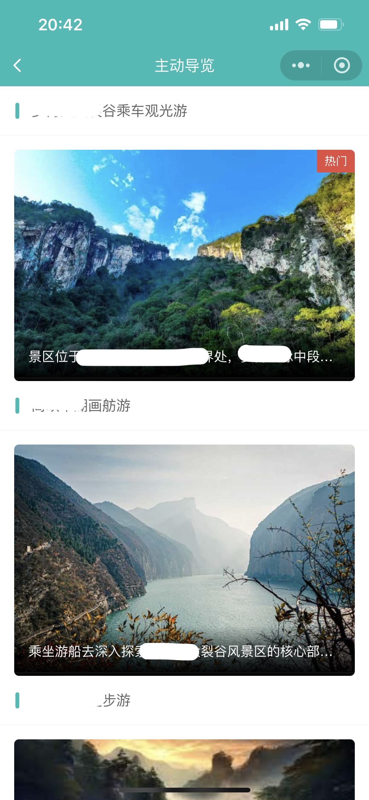
    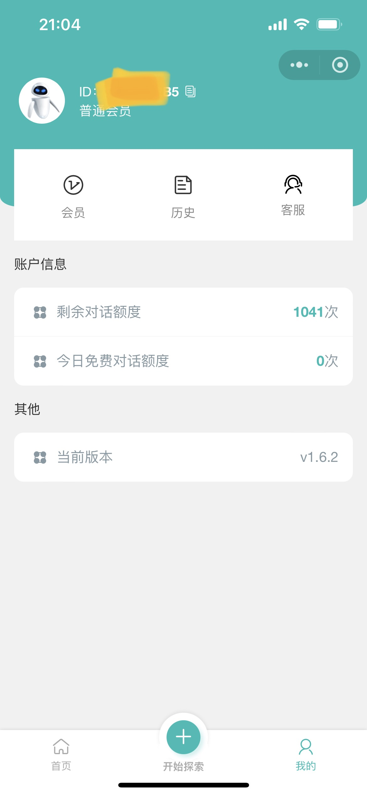

## 鸣谢

- 基于ChatGPT Java客户端[chatgpt-java](https://github.com/Grt1228/chatgpt-java)实现接口调用
