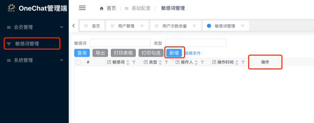

## ChatGPT-MP(基于ChatGPT实现的微信小程序)

包含前后台，技术栈：JDK8 + SpringBoot + Vue2 + Uniapp + Mysql。**开源版禁止商用，仅供学习交流，禁止倒卖。** 感谢Star！

Github地址：https://github.com/oldinaction/ChatGPT-MP

Gitee地址(国内访问更快)：https://gitee.com/smalle/ChatGPT-MP

小程序演示地址

## 包含功能

- [x] ChatGPT聊天
- [x] 用户聊天次数限制
- [x] 分享得聊天次数
- [x] 每日领取免费次数
- [x] 查看聊天历史
- [x] 显示连接情况
- [x] 清除聊天历史
- [x] 开通会员
- [x] 购买次数包
- [x] 联系客服领取次数
- [x] 看广告得次数
- [x] 后台管理系统，暂时为收费版功能，之后会择机开源
- [ ] AI生成图片、语音转换等功能开发中......

## 小程序样式预览

    
    
    

## 后端管理样式预览

## 开源版部署

### 后端

- 创建Mysql数据库aezo-chat-gpt, 执行脚本文件 aezo-chat-gpt-api/doc/aezo-chat-gpt.sql
- 使用IDEA打开aezo-chat-gpt-api项目
- 修改application.yml中的小程序id和秘钥、OpenAI地址和KEY
- 启动项目

### 前端小程序

- 使用HBuilder打开aezo-chat-gpt-m项目
- 修改common/config.js中的API地址
- 运行项目到微信小程序

## 版本功能比对

[收费版授权地址](https://ekey.aezo.cn/buy/1)

| 功能 | 开源版 | 收费版 |
|--|--|--|
| ChatGPT聊天 | ✅ | ✅ |
| 用户聊天次数限制 | ✅ | ✅ |
|  分享得聊天次数 | ✅ | ✅ |
| 每日领取免费次数 | ✅ | ✅ |
| 查看聊天历史 | ✅ | ✅ |
| 显示连接情况 | ✅ | ✅ |
| 清除聊天历史 | ✅ | ✅ |
| 开通会员 | ✅ | ✅ |
| 购买次数包 | ✅ | ✅ |
| 联系客服领取次数 | ✅ | ✅ |
| 看广告得次数 | ✅ | ✅ |
| 敏感词过滤 | ❌ | ✅ |
| 后台管理-用户次数管理 | ❌ | ✅ |
| 后台管理-用户次数扣除历史 | ❌ | ✅ |
| 后台管理-敏感词管理 | ❌ | ✅ |
| 后台管理-发送消息统计 | ❌| ✅ |
| 后台管理-邀请人数统计 | ❌ | ✅ |
| 详细部署及使用文档 | ❌ | ✅ |
| 售后服务 | ❌ | 交流学习群 |

## 交流学习

有问题可进群交流，为了防止各种广告，需小额打赏1元以上~(你的心意就是我最大的动力)，添加请注明来意！

    
点击查看联系方式（需小额打赏，添加注明OneChat）

    

## 鸣谢

- 基于ChatGPT Java客户端[chatgpt-java](https://github.com/Grt1228/chatgpt-java)实现接口调用
